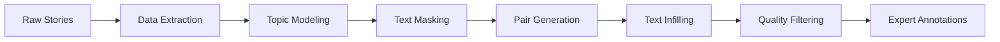

# SF-ProbeEval: Science Fiction Text Probing Evaluation Dataset

[](https://www.python.org/downloads/)
[](https://opensource.org/licenses/MIT)
[](https://arxiv.org/abs/2XXX.XXXXX)

A comprehensive evaluation dataset and pipeline for probing language model understanding of science fiction narratives through topic modeling, text infilling, and expert annotation.

## 🌟 Overview

SF-ProbeEval provides:

- **📚 Text Processing Pipeline**: Advanced topic modeling and paragraph segmentation for science fiction stories
- **🎭 Text Infilling System**: Masked language modeling for narrative coherence evaluation  
- **👨‍💼 Expert Annotations**: Human-annotated dataset with 250 carefully curated samples
- **📊 Evaluation Metrics**: Comprehensive scoring system for generated text quality

## 🚀 Quick Start

### Installation

```bash
# Clone the repository
git clone https://github.com/sjkkang/SF-ProbeEval.git
cd SF-ProbeEval

# Setup environment and install dependencies
./scripts/setup_environment.sh

# Activate virtual environment
source venv/bin/activate
```

### Run the Full Pipeline

```bash
# Run complete SF-ProbeEval pipeline
./scripts/run_full_pipeline.sh

# Or run individual steps
python -m src.sf_topic_pipeline.topic_modeling --help
python -m src.evaluation.create_expert_annotations --help
```

### Create Expert Annotations

```bash
# Generate expert annotation dataset
python -m src.evaluation.create_expert_annotations \
    --input data/processed/final_pairs_cleaned.csv \
    --samples 250 \
    --output-dir data/expert_annotations/
```

## 📊 Dataset

### Expert Annotations
- **📋 Size**: 250 text pairs with balanced score distribution
- **🎯 Score Range**: 1-5 (integer scores, equal stratification)
- **🔍 Quality**: Multi-stage filtering for completeness and coherence
- **📈 Balance**: 50 samples per score level (1-5)

### Data Statistics
| Metric | Value |
|--------|-------|
| Total Samples | 250 |
| Score Distribution | Equal (50 per score) |
| Filtering Applied | 7.7% samples removed |
| Source Corpus | Amazing Stories (1926+) |

### Sample Data Format
```csv
sample_id,original_text,modified_text,score,expert_score,expert_comments,annotation_date,annotator_id
1,"His impression of the method...","His impression of the method...",4.0,,,, 
```

## 🏗️ Architecture



### Pipeline Components

1. **📝 Data Extraction** (`data_extraction.py`)
   - HTML story extraction and metadata parsing
   - Paragraph segmentation and deduplication
   - Train/dev/test splits generation

2. **🧠 Topic Modeling** (`topic_modeling.py`)
   - Enhanced preprocessing with UMAP + HDBSCAN
   - Balanced topic discovery with quality metrics
   - Coherence-based evaluation

3. **🎭 Text Masking** (`topic_masking.py`) 
   - Topic-aware masking strategies
   - Context-preserving token selection
   - Multiple masking patterns

4. **👥 Pair Generation** (`pair_generation.py`)
   - Systematic text pair creation
   - Quality-based filtering
   - Similarity scoring

5. **🔤 Text Infilling** (`infill.py`)
   - Transformer-based text completion
   - Multiple model support (T5, BERT, etc.)
   - Confidence scoring

6. **🧹 Quality Control** (`filter_pairs.py`)
   - Multi-criteria filtering
   - Deduplication by similarity scores
   - Length and completeness validation

## 📚 Repository Structure

```
SF-ProbeEval/
├── src/                          # Source code
│   ├── sf_topic_pipeline/        # Core pipeline modules
│   └── evaluation/               # Evaluation tools
├── data/                         # Datasets and annotations
│   ├── raw/                      # Original story files
│   ├── processed/                # Processed datasets  
│   └── expert_annotations/       # Human annotation data
├── scripts/                      # Utility and run scripts
├── notebooks/                    # Analysis notebooks
├── configs/                      # Configuration files
├── tests/                        # Unit tests
└── docs/                         # Documentation
```

## 🔬 Reproducibility

### Preprocessing Configuration
```python
PreprocessConfig(
    lowercase=True,                    # Convert to lowercase
    remove_stopwords=True,             # Remove NLTK English stopwords
    lemmatize=True,                    # WordNet lemmatization
    min_word_length=3,                 # Minimum 3 characters per word
    min_alpha_ratio=0.7,              # 70% alphabetic characters required
    normalize_contractions=True,       # "won't" → "will not"
    normalize_hyphens=True             # "to-morrow" → "tomorrow"
)
```

### Quality Filtering Criteria
- ❌ **Error Patterns**: Remove "Answer:", "Sentence:" prefixes
- ❌ **Structural Text**: Filter "CHAPTER" headers and metadata  
- ❌ **Incomplete Text**: Remove single words or very short content
- ❌ **Invalid Format**: Ensure proper text pair structure
- ✅ **Length Validation**: 10+ characters and 3+ words minimum

### Deduplication Strategy
- **Primary Key**: `pair_id` deduplication
- **Selection Criteria**: Highest hybrid similarity score retained
- **Similarity Metrics**: Semantic + lexical + structural scoring

## 📈 Results & Evaluation

### Model Performance
- **Topic Coherence**: C_v scores with enhanced preprocessing
- **Quality Improvement**: ~7.7% noise reduction through filtering
- **Expert Agreement**: Balanced annotation distribution achieved

### Key Findings
1. **Enhanced Preprocessing**: Significant improvement in topic coherence
2. **Quality Filtering**: Effective noise reduction without bias
3. **Expert Validation**: Consistent annotation quality across score ranges

## 🤝 Contributing

We welcome contributions! Please see our [contributing guidelines](CONTRIBUTING.md).

### Development Setup
```bash
# Install development dependencies
./scripts/setup_environment.sh --dev

# Run tests
pytest tests/

# Format code
black src/ tests/
```

## 📄 License

This project is licensed under the MIT License - see the [LICENSE](LICENSE) file for details.

## 📚 Citation

If you use SF-ProbeEval in your research, please cite:

```bibtex
@article{kang2025sfprobeeval,
  title={SF-ProbeEval: Science Fiction Text Probing Evaluation Dataset},
  author={Kang, Sujin and [Other Authors]},
  journal={arXiv preprint arXiv:2XXX.XXXXX},
  year={2025}
}
```

## 🙋‍♀️ Contact & Support

- **Author**: Sujin Kang
- **Issues**: [GitHub Issues](https://github.com/sjkkang/SF-ProbeEval/issues)

